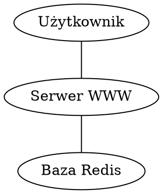

# UPH - MiOBD

## Zadanie

Realizacja systemu wyznaczania trasy dla pojazdów elektrycznych.

## Wymagania

Celem  zadania  projektowego  jest implementacja  przedstawionego  problemu  w  postaci  aplikacji internetowej opierając się o wybraną (dowolną) bazę danych NoSQL. Ostateczną formą zadania będzie przedstawienie aplikacji wykorzystującej podaną implementację.  W ramach zadania należy:

* Przedstawić w formie dokumentacji najważniejsze funkcjonalności programu, opis implementacji,  sposób  wykorzystania  bazy  danych  NoSQL  oraz  schemat  danych  użytych przez bazę.
* Stworzyć  aplikację  webową  (język  programowania  dowolny),  która będzie  realizowała wskazane w dokumentacji funkcjonalności. Najistotniejsze części kodu z punktu widzenia działania standardu powinny być szczegółowo opisane w dokumentacji. 

## Koncepcja

Koncepcja realizacji projektu opiera się na wykorzystaniu bazy danych Redis, która jest charakteryzowana zazwyczaj jako baza danych NoSQL typu "klucz-wartość". Zamierzamy przechowywać informacj o trasie w postaci grafu, gdzie wierzchołkami będą skrzyżowania dróg, a krawędziami ulice. 

Zostanie wykorzystanie algorytmu Dijkstry wspieranej zapytaniami klucz-wartość w celu ustalenia pełnej, szczegółowej trasy z uwzględnieniem kosztu odcinków (długości). Uzyskana trasa będzie optymalna tj. najkrótsza.

Zostaną wykorzystane dane:

* [baza stacji GreenWay](https://greenwaypolska.pl/nasze-stacje/)
* baza danych dróg - wygenerowana.

Przyjęto, że wyszukiwanie będzie odbywać się wyłącznie na terenie Polski. Trasa będzie dobiera w celu zapewnienia możliwości pokonania najkrótszej trasy.

# Architektura


Użytkownik wysyła żadania do serwera WWW za pomocą żadań REST API. Serwer WWW wspiera się w obsłudzę żadania baza danych Redis.

# Widoki

W aplikacji zostały zaimplementowane nastepujące operacje:
* dodawanie ulicy
* wyszukiwarnia drogi
* pobranie skrzyżowań sąsiadujących
* usuwanie ulicy
* pobranie wszystkich skrzyżowań

## Dodawanie ulicy

Dodawanie danych jest możliwe za pomocą interfejsu programowego opartego o JSON API.

```http
POST http://localhost:3000/1/2
Content-Type: application/json

{"value": 1}
```

## Wyszukiwarnia drogi

Algorytm wyszukiwania drogi działa zgodni z algorytmem Dijkstry, a wymagane informacje pobiera z bazy danych Redis w sposób asynchroniczny.

```http
GET http://localhost:3000/3/2
Content-Type: application/json

{
  "cost": null,
  "path": [
    "2",
    "6",
    "5",
    "3"
  ]
}
```

## Usuwanie ulicy

```http
DELETE http://localhost:3000/3/2
Content-Type: application/json

```


## Pobranie skrzyżowań sąsiadujących

Algorytm przeszukiwania pobiera dane informacje o wierzchołkach z bazy danych Redis. 

```http
GET http://localhost:3000/3
Content-Type: application/json

["1","2"]
```

## Pobranie wszystkich skrzyżowań

Algorytm przeszukiwania pobiera dane informacje o wierzchołkach z bazy danych Redis. 

```http
GET http://localhost:3000/
Content-Type: application/json

["1","2"]
```


# Algorytm wyznaczania trasy

W pracy został wykorzystana implementacja algorytmu Dijstra, który pozwala na znalezienie najkrótsze drogi w grafie ważonym. Przez najkrótszą drogę będziemy rozumieć drogę, która ma najniższą łączną odległość. Został wykorzystany graf skierowany.

# Model danych

W bazie danych istnieją następujące klucze:
``{u}_{v}`` - klucz zawierający informacje o długości odcinka
``{u}`` - zbiór zawierający informacje o sąsiadujacych krzyżowaniach
``_all`` - zbiór zawierający informacje o wszystkich krzyżowaniach

Wykorzystywane są następujące operacje bazy danych:
``add`` - dodanie klucza
``del`` - usunięcie klucza
``sadd`` - dodanie do zbioru pod podanym kluczem podanej wartości
``smembers`` - wykaz członków zbioru
``srem`` - usunięcie członka zbioru

Operacje wykonywane są w sposób asynchroniczny, a dane z bazy danych - w miarę możliwości – są zrównoleglone. 

# Możlwości rozwoju

Wybór bazy danych Redis był podyktowany wolą podjęcia wyzwania samodzielnej implementacji algorytmów grafowych w środowisku bazy danych o tak uproszczonych możliwościach. Uznaliśmy, że pozwala to na dogłębne zrozumienie specyfiki pracy baz grafowych. Dostrzegamy także, że tego rodzaju bazy danych – za sprawą ```consistent hashing``` – mają szczególne możliwości skalowania. 

Potencjał przyjętych założeń znalazł – podczas analizy otoczenia projektu – potwierdzenie w realnych projektach tj. baza danych [Titan](http://titan.thinkaurelius.com/).

Wykorzystanie Redis pozwala na optymalizacje aplikacji przez wykorzystanie modułu Geospartial, który pozwoli na 
wstępne przefiltorwaniu danych, jednak podczas przetwarzanych danych nie dostrzeżono takiej potrzeby. Wykorzystany algorytm wyznaczania trasy spełnia przyjęte założenia.

Sposób implementacji komunikacji z silnikiem Redis jest odizolowany w projekcie i ograniczony do 5 asynchronicznych  funkcji:

 * addEdge = async (u, v, value = 1) - nie zwraca wartości
 * delEdge = async (u, v) - nie zwraca wartości
 * getVertex = async () - zwraca listę krawędzi
 * getNeighbours = async (u) - zwraca listę krawędzi
 * getCost = async (u, v) - zwraca wartość liczbową

Stanowi to o potencjał rozwoju projektu, aby wprowadzić inne silniki składowania danych np. ```memcached``` lub pliki płaskie.
